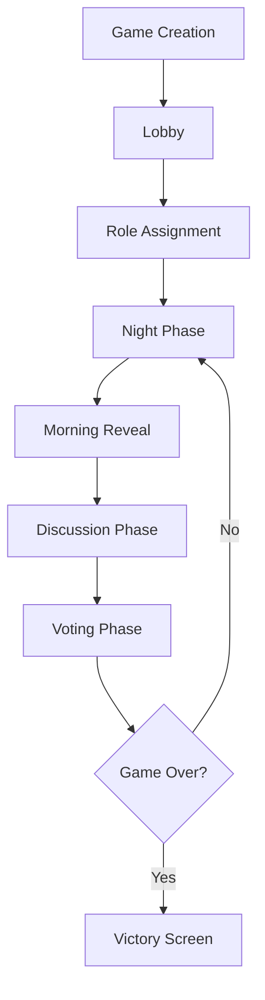
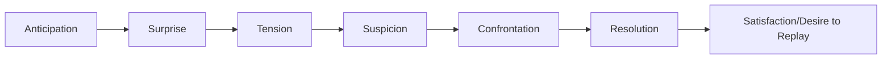

# WolfGang - Game Design Specification

> **Living Document**: This specification is regularly updated to reflect the current state and vision of WolfGang. Last updated: December 1, 2025

## Table of Contents
- [Vision & Goals](#vision--goals)
- [Target Audience](#target-audience)
- [Value Proposition](#value-proposition)
- [Core Gameplay](#core-gameplay)
- [Game Mechanics](#game-mechanics)
- [UI/UX Design](#uiux-design)
- [Player Experience](#player-experience)

---

## Vision & Goals

### What is WolfGang?
WolfGang is a **digital werewolf party game** that revolutionizes the classic social deduction game by eliminating common pain points: waiting, downtime, and the possibility of cheating.

### Core Goal
Create the most **engaging, fair, and streamlined werewolf experience** possible by leveraging technology to enable simultaneous gameplay while preserving the social dynamics that make werewolf games compelling.

### What Makes WolfGang Different?
1. **No Waiting**: All players act simultaneously during each phase
2. **No Cheating**: Digital role management prevents peeking and ensures fairness
3. **No Moderator Needed**: The app handles all game logic and role assignments
4. **Placebo Engagement**: Even "inactive" roles have engaging mini-activities
5. **Hybrid Social Experience**: Digital tools enhance, not replace, in-person interaction

---

## Target Audience

### Primary Audience
- **Social Gamers** (Ages 16-35) who enjoy party games at gatherings, events, or casual meetups
- **Board Game Enthusiasts** looking for modern takes on classic social deduction games
- **Event Organizers** seeking engaging group activities for 4-20 people

### User Personas

#### The Social Butterfly (Primary)
- Age: 18-28
- Context: Uses WolfGang at parties, game nights, team-building events
- Needs: Quick setup, easy to explain, engaging for everyone
- Tech Comfort: High (smartphone native)

#### The Game Night Host (Secondary)
- Age: 25-40
- Context: Regular game nights with friends
- Needs: Reliable, fair, replayable
- Tech Comfort: Medium to High

#### The Casual Player (Tertiary)
- Age: 16-50
- Context: Invited to play, not a regular gamer
- Needs: Intuitive interface, clear instructions, low barrier to entry
- Tech Comfort: Variable

---

## Value Proposition

### For Players
- ✅ **Zero Downtime**: Engage every second of the game
- ✅ **Fair Play**: Impossible to cheat or accidentally spoil
- ✅ **Instant Setup**: No cards, no props—just phones
- ✅ **Scale Flexibly**: Works with 4-20 players equally well
- ✅ **Social Connection**: Facilitates in-person interaction, not screen time

### For Hosts
- ✅ **No Moderation**: Focus on playing, not managing
- ✅ **Configurable**: Adjust roles and timing to group size
- ✅ **Trackable**: Game history and statistics
- ✅ **Accessible**: Works on any modern smartphone

### Why Users Will Love It
WolfGang solves the fundamental problems of traditional werewolf:
1. **Eliminated dead time** where players feel bored
2. **Prevented cheating** that ruins game integrity
3. **Removed moderator burden** so everyone can play
4. **Engaged all roles** so no one feels useless

---

## Core Gameplay

### Game Overview
WolfGang is a social deduction game where **villagers** try to identify and eliminate **werewolves** before the pack kills them all. The game alternates between **Night** and **Day** phases.

### Win Conditions
- **Villagers Win**: If all werewolves are eliminated
- **Werewolves Win**: If werewolves equal or outnumber remaining villagers

### Game Flow



### Phase Structure

#### 1. **Lobby Phase**
- Host creates game, receives 4-letter room code
- Players join using room code
- Players select avatar and name
- Host configures roles (auto-suggested based on player count)
- Minimum 4 players to start

#### 2. **Role Assignment**
- Roles distributed randomly
- Each player sees their role with dramatic reveal animation
- Roles are hidden from all other players

#### 3. **Night Phase** (⭐ THE INNOVATION)
**Duration**: 30-60 seconds (configurable)

All players act **simultaneously** based on their role:

| Role | Night Activity |
|------|---------------|
| **Werewolf** | Vote to kill a villager (see pack votes in real-time) |
| **Seer** | Choose one player to reveal their role |
| **Witch** | Use one-time heal or poison ability |
| **Hunter** | No night action |
| **Villager** | Interactive placebo mini-game (e.g., tap fireflies) |

**Key Innovation**: Villagers don't just stare at a screen—they get engaging "busy work" that feels meaningful.

#### 4. **Morning Reveal**
- Announcements of deaths (if any)
- Witch interventions revealed
- Dead players transition to "Ghost Mode"

#### 5. **Discussion Phase**
**Duration**: 60-120 seconds (configurable)

- Living players debate who might be a werewolf
- Optional: Text chat for remote play
- Timer displayed prominently

#### 6. **Voting Phase**
**Duration**: 30 seconds

- All living players vote simultaneously to eliminate someone
- Ties resolved by random selection or no elimination
- Voted player's role revealed (configurable)
- Dead player enters Ghost Mode

#### 7. **Ghost Mode** (The Afterlife)
Dead players can:
- Spectate the game with full role visibility
- Chat with other ghosts
- Place bets on who will win
- Still feel engaged in the outcome

---

## Game Mechanics

### Roles

#### **Werewolf** 🐺
- **Team**: Werewolves
- **Goal**: Eliminate all villagers
- **Night Power**: Vote to kill a villager
- **Special**: See other werewolves and their votes
- **Count**: 1-3 (scales with player count: ~25% of players)

#### **Villager** 👨‍🌾
- **Team**: Village
- **Goal**: Identify and eliminate all werewolves
- **Night Power**: None (plays mini-game)
- **Special**: None
- **Count**: Majority of players

#### **Seer** 🔮
- **Team**: Village
- **Goal**: Use knowledge to guide village
- **Night Power**: Reveal one player's true role
- **Special**: Information accumulates over nights
- **Count**: 0-1

#### **Witch** 🧙‍♀️
- **Team**: Village
- **Goal**: Protect village with strategic power usage
- **Night Power**: 
  - One-time **heal** to save wolf victim
  - One-time **poison** to kill anyone
- **Special**: Can use both powers, but only once each
- **Count**: 0-1

#### **Hunter** 🏹
- **Team**: Village
- **Goal**: Take revenge when eliminated
- **Night Power**: None
- **Special**: When killed, immediately shoots another player
- **Count**: 0-1

### Role Distribution Algorithm

Intelligent role assignment based on player count:

| Players | Werewolves | Seer | Witch | Hunter | Villagers |
|---------|------------|------|-------|--------|-----------|
| 4-5 | 1 | 1 | 0 | 0 | 2-3 |
| 6-8 | 2 | 1 | 1 | 0 | 2-4 |
| 9-12 | 2 | 1 | 1 | 1 | 4-7 |
| 13-16 | 3 | 1 | 1 | 1 | 7-10 |
| 17-20 | 4 | 1 | 1 | 1 | 10-13 |

### Voting Mechanics

#### Night Voting (Werewolves)
- Each wolf independently selects a victim
- Votes visible to all wolves in real-time
- Most voted player dies
- In case of tie: random selection among top votes

#### Day Voting (All Living Players)
- Each player votes to execute someone
- Vote counts revealed after timer expires
- Most voted player eliminated
- Tie options: no elimination OR random selection (configurable)

---

## UI/UX Design

### Design Philosophy
**Gothic | Atmospheric | Immediately Understandable**

WolfGang's interface should evoke a mysterious, nocturnal atmosphere while remaining crystal clear and accessible to new players.

### Visual Identity

#### Color Palette
- **Deep Purple** `#2D0A31` - Primary background
- **Midnight Blue** `#0F172A` - Secondary background
- **Blood Red** `#DC2626` - Accent, danger, werewolf theme
- **White/Gray** - Text and UI elements with varying opacity

#### Typography
- **Cinzel** (serif) - Headers, dramatic moments (role reveals, announcements)
- **Inter** (sans-serif) - Body text, UI elements, readability

#### Visual Themes
- **Dark Mode First**: Optimized for playing in low-light social settings
- **Glassmorphism**: Frosted glass effects with blur and transparency
- **Gradients**: Subtle gradients for depth and premium feel
- **Animations**: Smooth, purposeful transitions using Framer Motion

### Screen-by-Screen Design

#### 🏠 Landing Page
```
┌─────────────────────────────┐
│                             │
│          🌙                 │
│                             │
│      WOLFGANG               │
│                             │
│  Die hybride Werwolf-       │
│      Revolution.            │
│                             │
│  ┌───────────────────┐      │
│  │ 🌙 Spiel erstellen│      │
│  └───────────────────┘      │
│                             │
│  ┌───────────────────┐      │
│  │ 👥 Beitreten      │      │
│  └───────────────────┘      │
│                             │
│  v0.1.0 • Alpha Build       │
└─────────────────────────────┘
```

**Key Elements**:
- Large, dramatic logo/title
- Clear CTAs (Create / Join)
- Minimal, focused layout
- Version indicator

#### 🎮 Lobby
- **Avatar Selection**: Grid of emoji options
- **Player Name**: Text input
- **Room Code Display**: Large, copyable code (hosts)
- **Player List**: Live-updating participant list
- **Start Button**: Enabled when minimum players met (hosts)

#### 🎭 Role Reveal
- **Dramatic Animation**: Card flip or fade-in effect
- **Role Icon**: Large emoji representation
- **Role Name**: "Du bist ein WERWOLF"
- **Ability Description**: Clear, concise explanation
- **Teammate Info**: (Werewolves see pack members)

#### 🌙 Night Phase
**Dynamic based on role**:

| Role | Interface |
|------|-----------|
| Werewolf | Grid of victims + live pack votes |
| Seer | Grid of players to investigate |
| Witch | Conditional: heal/poison options |
| Villager | Mini-game (tap fireflies, constellation puzzle) |

**Universal Elements**:
- **Timer**: Prominent countdown
- **Your Role**: Small reminder at top
- **Phase Indicator**: "Night Phase" badge

#### ☀️ Day Phase
- **Morning Announcement**: Death(s) revealed
- **Discussion Timer**: Live countdown
- **Player Grid**: All living players
- **Voting Interface**: Tap to accuse
- **Execution Result**: Role reveal with animation

#### 👻 Ghost Mode
- **Grayscale Filter**: Distinct visual state
- **Full Visibility**: See all roles
- **Ghost Chat**: Communicate with dead players
- **Betting**: Predict winner (optional)
- **Spectate**: Continue following game

### Interaction Patterns

#### Gestures & Feedback
- **Tap**: Select targets, make choices
- **Hold**: View detailed info (e.g., role descriptions)
- **Haptic Feedback**: Vibrations for important moments (death, role reveal)
- **Sound Effects**: Optional ambient sounds and event triggers

#### Accessibility
- **High Contrast**: Readable in various lighting
- **Large Touch Targets**: Minimum 44x44px
- **Clear Typography**: No tiny text
- **Color Independence**: Not relying solely on color to convey info

---

## Player Experience

### Onboarding
1. **First-Time User**: Brief tutorial overlay on first launch
2. **Role Reveal**: Clear ability explanation with each role
3. **Progressive Disclosure**: Complexity introduced gradually

### Engagement Loops

#### Short Loop (Single Game)
```
Join → Role Assignment → Night → Day → Repeat → Victory/Defeat
```
**Duration**: 10-20 minutes per game

#### Medium Loop (Game Night)
```
Game 1 → Debrief → Game 2 → ... → Session End
```
**Duration**: 1-3 hours
**Retention**: Different roles, revenge matches

#### Long Loop (Community)
```
First Game → Friends Recommend → Host Games → Regular Player
```
**Acquisition**: Viral, word-of-mouth

### Emotional Arc



1. **Anticipation**: Joining, waiting for roles
2. **Surprise**: Role reveal
3. **Tension**: Night phase actions
4. **Suspicion**: Morning deaths, discussion
5. **Confrontation**: Voting, accusations
6. **Resolution**: Victory or defeat
7. **Replay Desire**: Driven by social dynamics

### Social Dynamics
- **In-Person Priority**: App enhances, doesn't replace face-to-face interaction
- **Conversation Catalyst**: Generates stories ("Remember when...")
- **Group Bonding**: Shared experience, inside jokes
- **Replayability**: Emerging strategies, role variety

---

## Future Considerations

### Potential Expansions
- Custom role creation
- Themed skin packs (horror, fantasy, sci-fi)
- Tournament mode with rankings
- Replays and highlight clips
- Advanced statistics and analytics

### Internationalization
- Multi-language support (English, German initially)
- Regional role name variations
- Cultural customization options

---

**Document Version**: 1.0  
**Last Updated**: December 1, 2025  
**Maintained by**: Product Team  
**Review Cycle**: Monthly or after major feature additions
