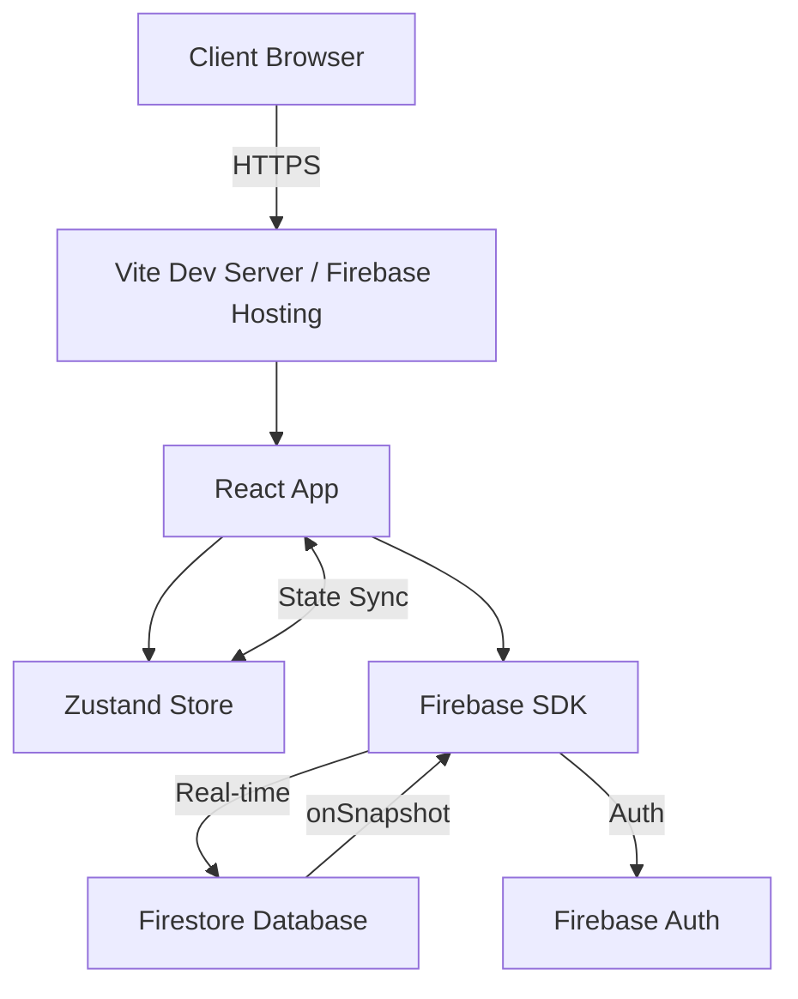
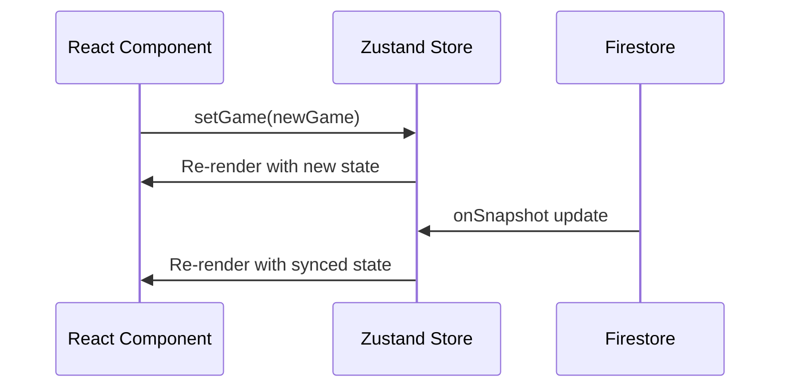

# WolfGang - Technical Specification

> **Living Document**: This specification is regularly updated to reflect the current technical implementation and architecture. Last updated: December 1, 2025

## Table of Contents
- [Technology Stack](#technology-stack)
- [Architecture Overview](#architecture-overview)
- [Project Structure](#project-structure)
- [Core Systems](#core-systems)
- [Data Models](#data-models)
- [Firebase Integration](#firebase-integration)
- [State Management](#state-management)
- [Deployment](#deployment)
- [Development Workflow](#development-workflow)

---

## Technology Stack

### Frontend
- **Framework**: React 19.2.0
- **Language**: TypeScript 5.9.3
- **Build Tool**: Vite 7.2.4
- **Routing**: React Router DOM 7.9.6
- **State Management**: Zustand 5.0.9
- **Styling**: Tailwind CSS 3.4.17
- **Animations**: Framer Motion 12.23.25
- **Icons**: Lucide React 0.555.0

### Backend / Database
- **Backend Service**: Firebase
  - **Firestore**: Real-time NoSQL database
  - **Authentication**: Anonymous auth for player sessions
  - **Hosting**: (Future: Firebase Hosting for production)

### Development Tools
- **Linting**: ESLint 9.39.1
- **Type Checking**: TypeScript with strict mode
- **Package Manager**: npm

### PWA (Progressive Web App)
- **Plugin**: vite-plugin-pwa 1.2.0
- **Service Worker**: Auto-generated
- **Manifest**: Configured for installability

---

## Architecture Overview

### System Architecture



### Design Pattern
**Client-Side Architecture** with real-time synchronization:
- **Single Page Application (SPA)**: React-based
- **Optimistic UI Updates**: Local state updates immediately, syncs to Firestore
- **Real-time Listeners**: Firestore `onSnapshot` for live game updates
- **Host-Driven Logic**: Host client runs game logic (phase transitions, resolution)

### Key Architectural Decisions

#### 1. **Host as Controller**
- Only the **host's device** runs game logic
- Other players are **observers** with action submission capabilities
- Prevents conflicts and ensures single source of truth
- Trade-off: Host disconnection requires migration logic (future)

#### 2. **Firestore as Single Source of Truth**
- All game state lives in Firestore
- Clients subscribe to changes via `onSnapshot`
- No local database needed
- Enables easy reconnection and spectating

#### 3. **Anonymous Authentication**
- No account creation required
- Player ID generated client-side
- Stored in Zustand for session persistence
- Future: Optional persistent accounts

---

## Project Structure

```
Schattenwelt/ (to be renamed to WolfGang)
├── docs/                       # Timeless documentation
│   ├── GAME_DESIGN_SPEC.md    # Game design & mechanics
│   ├── TECHNICAL_SPEC.md      # This file
│   └── PRODUCT_ROADMAP.md     # Feature roadmap & milestones
├── archive/                    # Historical documents
│   ├── IMPLEMENTATION_PLAN.md # Original implementation plan
│   └── NEXT_STEPS.md          # Historical next steps
├── public/                     # Static assets
│   ├── favicon.ico
│   └── manifest.json          # PWA manifest
├── src/
│   ├── components/            # React components
│   │   ├── ui/                # Reusable UI components
│   │   │   ├── Button.tsx
│   │   │   ├── Card.tsx
│   │   │   └── Input.tsx
│   │   ├── game/              # Game-specific components
│   │   │   ├── NightPhase.tsx (future)
│   │   │   ├── DayPhase.tsx (future)
│   │   │   └── RoleReveal.tsx (future)
│   │   ├── ConnectionStatus.tsx
│   │   └── Layout.tsx
│   ├── pages/                 # Route-level components
│   │   ├── Landing.tsx
│   │   ├── Lobby.tsx
│   │   └── Game.tsx
│   ├── lib/                   # Business logic & services
│   │   ├── firebase.ts        # Firebase initialization
│   │   └── gameService.ts     # Game CRUD operations
│   ├── store/                 # State management
│   │   └── gameStore.ts       # Zustand store
│   ├── types/                 # TypeScript definitions
│   │   └── index.ts
│   ├── App.tsx                # Root component with routing
│   └── main.tsx               # Entry point
├── .env                       # Environment variables (gitignored)
├── .env.example               # Template for env vars
├── firebase.json              # Firebase configuration
├── package.json               # Dependencies
├── tailwind.config.js         # Tailwind configuration
├── tsconfig.json              # TypeScript configuration
├── vite.config.ts             # Vite configuration
└── README.md                  # Project overview
```

---

## Core Systems

### 1. Game Service (`src/lib/gameService.ts`)

Handles all game operations and Firebase interactions.

#### Key Functions

##### `createGame(hostId, hostName, hostAvatar): Promise<roomCode>`
- Generates unique 4-letter room code
- Initializes game state in Firestore
- Returns room code for joining

##### `joinGame(roomCode, playerId, playerName, playerAvatar): Promise<boolean>`
- Validates game exists and is in lobby
- Adds player to game
- Throws error if game started or not found

##### `startGame(roomCode): Promise<void>`
- Assigns roles based on player count
- Transitions game to NIGHT phase
- Sets initial phase timer

##### `subscribeToGame(roomCode, callback): Unsubscribe`
- Creates real-time listener on game document
- Calls callback on every update
- Returns unsubscribe function for cleanup

##### `submitWolfVote(roomCode, wolfId, targetId): Promise<void>`
- Records werewolf's target selection
- Updates visible to all wolves

##### `submitSeerCheck(roomCode, targetId): Promise<void>`
- Records seer's investigation choice

##### `submitDayVote(roomCode, voterId, targetId): Promise<void>`
- Records player's accusation vote

#### Role Assignment Algorithm

```typescript
function assignRoles(playerIds: string[], roleConfig: {
  wolves: number;
  seer: number;
  witch: number;
}): Record<string, Role>

// Default scaling:
wolves = Math.max(1, Math.floor(playerCount / 4))
seer = 1 (if 5+ players)
witch = 1 (if 6+ players)
hunter = 1 (if 9+ players)
```

### 2. State Management (`src/store/gameStore.ts`)

Zustand store for local state persistence and UI reactivity.

```typescript
interface GameStore {
  playerId: string | null;
  game: GameState | null;
  setPlayerId: (id: string) => void;
  setGame: (game: GameState) => void;
}
```

**Persistence**: Player ID persists across sessions (future: localStorage middleware)

### 3. Firebase Configuration (`src/lib/firebase.ts`)

Initializes Firebase app and exports service instances.

```typescript
import { initializeApp } from 'firebase/app';
import { getFirestore } from 'firebase/firestore';

const firebaseConfig = {
  apiKey: process.env.VITE_FIREBASE_API_KEY,
  authDomain: process.env.VITE_FIREBASE_AUTH_DOMAIN,
  projectId: process.env.VITE_FIREBASE_PROJECT_ID,
  // ...
};

export const app = initializeApp(firebaseConfig);
export const db = getFirestore(app);
```

**Environment Variables**: Loaded from `.env`, never committed to git.

---

## Data Models

### TypeScript Types (`src/types/index.ts`)

#### `Role`
```typescript
type Role = 'WOLF' | 'VILLAGER' | 'SEER' | 'WITCH' | 'HUNTER';
```

#### `GameStatus`
```typescript
type GameStatus = 'LOBBY' | 'NIGHT' | 'DAY' | 'GAMEOVER';
```

#### `Player`
```typescript
interface Player {
  id: string;           // Unique player identifier
  name: string;         // Display name
  role: Role;           // Assigned role
  isAlive: boolean;     // Living/dead state
  avatar: string;       // Emoji avatar
}
```

#### `NightActions`
```typescript
interface NightActions {
  wolfVotes: Record<string, string>;  // voterId -> targetId
  witchHealUsed: boolean;
  witchPoisonUsed: boolean;
  seerCheck: string | null;           // targetId or null
}
```

#### `GameState`
```typescript
interface GameState {
  id: string;                         // Room code
  hostId: string;                     // Host player ID
  status: GameStatus;                 // Current phase
  phaseEndTime: number;               // Unix timestamp
  players: Record<string, Player>;    // playerId -> Player
  nightActions: NightActions;
  dayVotes: Record<string, string>;   // voterId -> targetId
  winner: 'VILLAGERS' | 'WEREWOLVES' | null;
}
```

### Firestore Schema

#### Collection: `games`

Document ID: `<ROOM_CODE>` (e.g., "WOLF", "PREY")

```json
{
  "id": "WOLF",
  "hostId": "player_abc123",
  "status": "NIGHT",
  "phaseEndTime": 1701461234567,
  "players": {
    "player_abc123": {
      "id": "player_abc123",
      "name": "Luna",
      "role": "WOLF",
      "isAlive": true,
      "avatar": "🐺"
    },
    "player_xyz789": {
      "id": "player_xyz789",
      "name": "Marcus",
      "role": "SEER",
      "isAlive": true,
      "avatar": "🔮"
    }
  },
  "nightActions": {
    "wolfVotes": {
      "player_abc123": "player_xyz789"
    },
    "witchHealUsed": false,
    "witchPoisonUsed": false,
    "seerCheck": "player_abc123"
  },
  "dayVotes": {},
  "winner": null
}
```

**Security Rules** (Future):
```javascript
rules_version = '2';
service cloud.firestore {
  match /databases/{database}/documents {
    match /games/{gameId} {
      // Anyone can read game state
      allow read: if true;
      
      // Only allow writes to specific fields
      allow update: if request.auth != null &&
        (request.resource.data.diff(resource.data).affectedKeys()
          .hasOnly(['nightActions', 'dayVotes', 'players']));
    }
  }
}
```

---

## Firebase Integration

### Setup Steps

1. Create Firebase project at [console.firebase.google.com](https://console.firebase.google.com)
2. Enable **Firestore Database** (Start in test mode initially)
3. Enable **Authentication** → Anonymous provider
4. Copy web app configuration
5. Add keys to `.env`:

```bash
VITE_FIREBASE_API_KEY=your_api_key
VITE_FIREBASE_AUTH_DOMAIN=your_project.firebaseapp.com
VITE_FIREBASE_PROJECT_ID=your_project_id
VITE_FIREBASE_STORAGE_BUCKET=your_project.appspot.com
VITE_FIREBASE_MESSAGING_SENDER_ID=123456789
VITE_FIREBASE_APP_ID=1:123456789:web:abc123
```

### Real-time Updates

Firestore `onSnapshot` enables live synchronization:

```typescript
const unsubscribe = onSnapshot(
  doc(db, 'games', roomCode),
  (snapshot) => {
    if (snapshot.exists()) {
      const gameData = snapshot.data() as GameState;
      updateLocalState(gameData);
    }
  }
);

// Cleanup on component unmount
return () => unsubscribe();
```

### Performance Considerations

- **Document Reads**: Each `onSnapshot` counts as 1 read on initial load + 1 per update
- **Optimization**: Use subcollections for chat/history to avoid re-reading entire game
- **Offline Support**: Firestore SDK caches data for offline access

---

## State Management

### Zustand Store Pattern

```typescript
import { create } from 'zustand';

export const useGameStore = create<GameStore>((set) => ({
  playerId: null,
  game: null,
  setPlayerId: (id) => set({ playerId: id }),
  setGame: (game) => set({ game }),
}));
```

### State Flow



### Future: Persistence Middleware

```typescript
import { persist } from 'zustand/middleware';

export const useGameStore = create(
  persist<GameStore>(
    (set) => ({...}),
    { name: 'wolfgang-storage' }
  )
);
```

---

## Deployment

### Development

```bash
npm run dev        # Start Vite dev server (localhost:5173)
npm run lint       # Run ESLint
npm run build      # Build for production
npm run preview    # Preview production build
```

### Production (Future)

#### Option 1: Firebase Hosting
```bash
npm run build
firebase deploy --only hosting
```

#### Option 2: Vercel / Netlify
- Connect GitHub repository
- Build command: `npm run build`
- Output directory: `dist`

### PWA Deployment

Vite PWA plugin auto-generates:
- Service worker for offline support
- Web manifest for installability
- Asset caching strategies

---

## Development Workflow

### Branching Strategy (Future)
- `main` - Production-ready code
- `develop` - Integration branch
- `feature/*` - Feature branches

### Code Standards

#### TypeScript
- Strict mode enabled
- No `any` types without justification
- Explicit return types for functions

#### React
- Functional components only
- Hooks for state and effects
- Props destructuring

#### Styling
- Tailwind utility classes
- Custom design tokens in `tailwind.config.js`
- No inline styles

#### File Naming
- Components: PascalCase (`PlayerGrid.tsx`)
- Utilities: camelCase (`gameService.ts`)
- Types: PascalCase (`GameState`)

### Testing (Future)
- **Unit Tests**: Vitest for utilities and services
- **Component Tests**: React Testing Library
- **E2E Tests**: Playwright for full game flows

---

## Performance Optimization

### Current Optimizations
- Code splitting via React Router lazy loading (future)
- Vite tree-shaking and minification
- Framer Motion lazy loading

### Monitoring (Future)
- Firebase Performance Monitoring
- Web Vitals tracking
- Error logging (Sentry)

---

## Security Considerations

### Current
- Environment variables for Firebase config
- No sensitive data in client code
- Anonymous auth prevents impersonation

### Future Hardening
- Firestore Security Rules for write validation
- Rate limiting on game creation
- Input sanitization for names/chat
- Admin SDK for sensitive operations (role assignment)

---

## Known Limitations & Technical Debt

1. **Host Dependency**: Game fails if host disconnects (need host migration)
2. **No Persistence**: Player sessions don't persist across refreshes (need localStorage)
3. **Basic Auth**: Anonymous auth doesn't prevent duplicate names (need unique constraints)
4. **No Validation**: Client can submit malformed data (need server-side validation)
5. **Static Roles**: Role configuration not customizable (need UI for role selection)

---

## Environment Variables Reference

| Variable | Purpose | Example |
|----------|---------|---------|
| `VITE_FIREBASE_API_KEY` | Firebase API key | `AIza...` |
| `VITE_FIREBASE_AUTH_DOMAIN` | Auth domain | `wolfgang-app.firebaseapp.com` |
| `VITE_FIREBASE_PROJECT_ID` | Project identifier | `wolfgang-app` |
| `VITE_FIREBASE_STORAGE_BUCKET` | Storage bucket | `wolfgang-app.appspot.com` |
| `VITE_FIREBASE_MESSAGING_SENDER_ID` | FCM sender ID | `123456789` |
| `VITE_FIREBASE_APP_ID` | App identifier | `1:123456789:web:abc123` |

---

**Document Version**: 1.0  
**Last Updated**: December 1, 2025  
**Maintained by**: Engineering Team  
**Review Cycle**: After major architectural changes or quarterly
